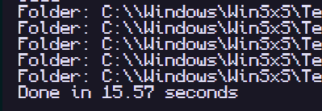

# win-finder

Multithreaded CLI files finder for Windows (This software is still in alpha!)

### How to use

Download the binary, then run `win-finder <dir> <query>`

### Performance

Running the program to search "amd" in the whole filesystem, starting from `C:\`, printing both directory and file path.

Single threaded code runs in ~15 seconds:

Multithreaded code runs in ~2 seconds:

# That is 87% faster!

You can explore the single threaded version code in this [commit](https://github.com/douglasselias/win-finder/commit/6534f0046b5dabcd96acee05fd406f4c8402c6d8) and compare with the latest commit.